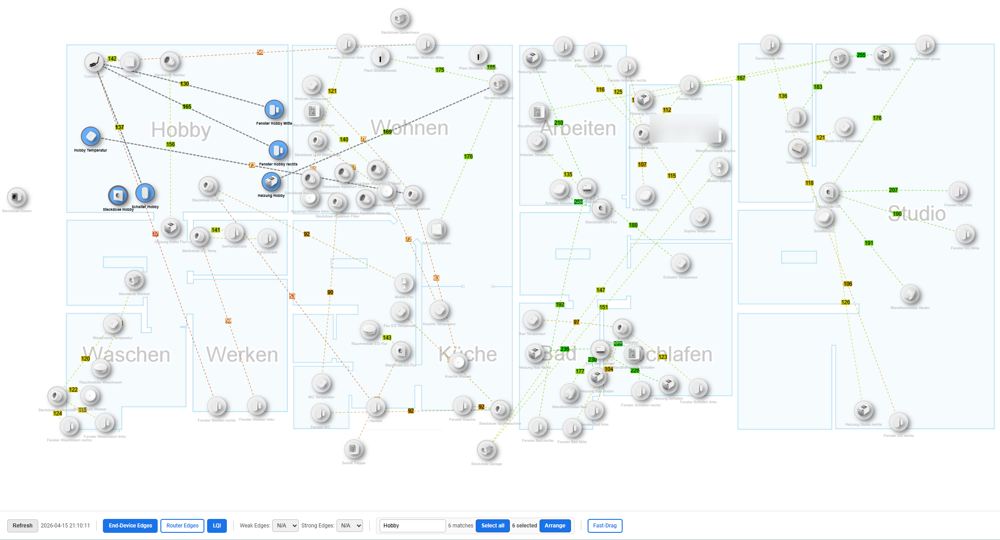

# zigbee2mqtt-networkmap

A [Custom Card](https://developers.home-assistant.io/docs/frontend/custom-ui/custom-card) for [Home Assistant](https://www.home-assistant.io/) to show the [Zigbee2mqtt](https://github.com/Koenkk/zigbee2mqtt/) network map with [vis-network](https://visjs.github.io/vis-network/docs/network/).

# Enhancements
- Double click on a node to find its strongest path to the Coordinator. Strongest means that the weakest LQI of an edge is greater or equal the weakest LQI of alternative paths.
- Toggle **LQI**, **Fast-Drag**, **End-Device Edges** and **Router Edges** with styled toggle buttons in the toolbar
- Filter **Weak** and **Strong** edges via dropdowns (N/A / Only / Hide)
- Show a background image (e.g. floor plan) behind the network graph that pans and zooms with it — configure with `background_image`, `background_opacity`, `background_network_width`, `background_network_x`, `background_network_y`
- Configure an initial zoom level applied after the graph stabilises with `initial_zoom`
- Reduced zoom speed on touch/tablet screens (70% slower than default)
- Zoom level, pan position and UI settings are automatically persisted in `localStorage` and restored on every page reload — independently of MQTT
- Optional `cached_entity` support: the card mirrors the live network map to a retained MQTT topic so nodes are instantly visible after a Home Assistant reboot, without waiting for zigbee2mqtt to regenerate the map
- **Multi-node selection and drag**: Ctrl/Cmd+click (desktop) or long-press (tablet) to select multiple nodes and drag them together
- **Rubber-band selection**: hold **Shift** and drag on the canvas to draw a selection rectangle around multiple nodes
- **Search → Select all**: type in the Search box and press **Select all** to add all matching nodes to the selection
- **Arrange**: with nodes selected, press **Arrange** to place them in a compact grid around their current centre — useful for grouping devices by room
- **Last-known refresh timestamp**: if the HA entity is `unknown` or `unavailable` after a reboot, the toolbar shows the most recent valid timestamp with a `(last known)` label until fresh data arrives

## Screenshot

Example (Home Assistant dashboard with floor plan background):



The **bottom bar** is the card toolbar:

- **Refresh** — Requests a new map from Zigbee2MQTT. The button is disabled while a refresh is running.
- **Timestamp** — Map “age” from Home Assistant: `Refreshing…`, the last successful publish time, or a **(last known)** time if the entity was briefly unavailable after a reboot.
- **End-Device Edges**, **Router Edges**, **LQI** — Toggles for which links are drawn and whether LQI labels appear on edges.
- **Weak Edges** / **Strong Edges** — Dropdowns (N/A / Only / Hide) to emphasise or hide low- or high-LQI links.
- **Search** (grouped in one bordered box) — Filters nodes by name; with matches, a count and **Select all** add every matching node to the selection. When at least one node is selected, **N selected** and **Arrange** appear in the same box; **Arrange** places two or more selected nodes in a compact grid around their centre.
- **Fast-Drag** — Hides edges while dragging so large graphs stay responsive.

### Example: select and position several nodes (e.g. one room)

1. In **Search**, type `Studio` — nodes whose names contain that text are highlighted and the rest of the graph is de-emphasised so you can see the matches.
2. Click **Select all** — every matching node is added to the selection (toolbar shows something like **6 selected** if six devices matched).
3. Click **Arrange** — the selected nodes are laid out in a tight grid around their current centre so they are easier to grab as a single group.
4. Drag any one of the selected nodes (desktop: normal drag; tablet: long-press then drag). **All** selected nodes move together so you can place the whole group on the floor plan or next to other devices.
5. Release to drop them; positions are saved like any other dragged nodes.

You can refine the selection with Ctrl/Cmd+click or **Shift**+drag on the canvas if you need to add or remove nodes before moving the group.

## Home Assistant setup

Update Zigbee2mqtt to version 1.17.0 or later, earlier version may not work.

This instruction is for Home Assistant 0.107 and later.

For 0.106 and earlier instruction can be found [here](https://github.com/azuwis/zigbee2mqtt-networkmap/tree/e6ea1b5fcf680372446ad11e968f429f8f8c1c18).

### Backend setup

In `configuration.yaml` of the Home Assistant installation:
``` yaml
mqtt:
  sensor:
    - name: zigbee2mqtt_networkmap
      state_topic: zigbee2mqtt/bridge/response/networkmap
      value_template: >-
        {{ now().strftime('%Y-%m-%d %H:%M:%S') }}
      json_attributes_topic: zigbee2mqtt/bridge/response/networkmap
      json_attributes_template: "{{ value_json.data.value | tojson }}"
    - name: zigbee2mqtt_networkmap_layout
      state_topic: zigbee2mqtt/bridge/networkmap/layout
      value_template: >-
        {{ now().strftime('%Y-%m-%d %H:%M:%S') }}
      json_attributes_topic: zigbee2mqtt/bridge/networkmap/layout
      json_attributes_template: "{{ value_json | tojson }}"
    # Optional but recommended: retains a copy of the last network map so the
    # card can show nodes immediately after a Home Assistant reboot, without
    # waiting for zigbee2mqtt to regenerate the map (~1-2 min on large networks).
    - name: zigbee2mqtt_networkmap_cached
      state_topic: zigbee2mqtt/bridge/networkmap/cached
      value_template: >-
        {{ now().strftime('%Y-%m-%d %H:%M:%S') }}
      json_attributes_topic: zigbee2mqtt/bridge/networkmap/cached
      json_attributes_template: "{{ value_json.data.value | tojson }}"
```

### Frontend setup (HACS)

1. **Install [HACS](https://www.hacs.xyz/docs/setup/download)** if you do not have it yet (depends on how Home Assistant is installed — follow the official guide).

2. **Install this card from HACS:** open **HACS** → **Frontend** → search for **Zigbee2mqtt networkmap** (or the exact name shown) → **Download** / install.
   If it does not appear, add the repository under **HACS** → **⋯** menu → **Custom repositories** (use this project’s GitHub URL, category **Dashboard** / **Plugin** as HACS asks), then install from **Frontend**.

3. **Register the Lovelace resource** (Home Assistant does not always attach it automatically):

   - Edit your profile (bottom item in the left menu in the web UI). Enable **Advanced Mode**.
   - **Settings** → **Dashboards** → **⋯** (upper right) → **Resources** → **ADD RESOURCE**.
   - URL: `/hacsfiles/zigbee2mqtt-networkmap/zigbee2mqtt-networkmap.js` — type **JavaScript Module** → **CREATE**.

4. **Refresh the browser** (or reload Lovelace) if the card does not show up when adding a card.

Under **HACS** → **Frontend**, the integration should show as installed without errors. Then continue with [Card setup](#card-setup-dashboard-web-ui).

### Card setup (Dashboard Web UI)

In order to add this card to the dashboard, Use the *Edit Dashboard* on the top right , three-dots menu, add a manual card, and use this configuration:
```
type: custom:zigbee2mqtt-networkmap
entity: sensor.zigbee2mqtt_networkmap
```
Make sure to use the same name of the sensor defined under `configuration.yaml`, based on the `Zigbee2mqtt Networkmap` name.

Or if you use yaml files for dashboards (example aligned with `DASHBOARDS/Tablet/Zigbee.yaml`):
``` yaml
theme: Backend-selected
title: Zigbee Network
type: panel
cards:
  - type: custom:zigbee2mqtt-networkmap
    entity: sensor.zigbee2mqtt_networkmap
    cached_entity: sensor.zigbee2mqtt_networkmap_cached
    layout_entity: sensor.zigbee2mqtt_networkmap_layout
    # the following are optional:
    mqtt_base_topic: zigbee2mqtt # if you change base_topic of Zigbee2mqtt, change it accordingly
    mqtt_topic: zigbee2mqtt/bridge/request/networkmap # or you can specify the full mqtt topic, see https://www.zigbee2mqtt.io/guide/usage/mqtt_topics_and_messages.html#zigbee2mqtt-bridge-request
    mqtt_payload: { type: 'raw', routes: true }
    force: 3000 # decrease it to get smaller map if you have many devices
    node_size: 16
    font_size: 12
    link_width: 2
    height: 1000 # height of the card
    # use this css config or use whatever css tech to change look and feel,
    # the same variable can also be used in Home Assistant themes, see https://www.home-assistant.io/components/frontend/#defining-themes
    background_image: /local/floorplan.png   # path to your image
    background_opacity: 0.6                  # 0.0 invisible, 1.0 fully opaque (default: 0.3)
    background_network_width: 2500           # width of the image in network coordinates (height is auto from aspect ratio)
    initial_zoom: 1.0                        # zoom scale applied after the graph stabilises (read the live value from the "Zoom:" display in the toolbar)
    # background_network_x: -500            # left edge in network coords (default: -background_network_width/2)
    # background_network_y: -500            # top edge in network coords (default: -height/2)
    css: |
      :host {
        --zigbee2mqtt-networkmap-node-color: rgba(18, 120, 98, .7);
        --zigbee2mqtt-networkmap-node-fill-color: #dcfaf3;
        --zigbee2mqtt-networkmap-node-pinned-color: rgba(190, 56, 93, .6);
        --zigbee2mqtt-networkmap-link-color: rgba(18, 120, 98, .5);
        --zigbee2mqtt-networkmap-hover-color: #be385d;
        --zigbee2mqtt-networkmap-link-selected-color: rgba(202, 164, 85, .6);
        --zigbee2mqtt-networkmap-label-color: #127862;
        --zigbee2mqtt-networkmap-arrow-color: rgba(18, 120, 98, 0.7);
        --zigbee2mqtt-networkmap-node-coordinator-color: rgba(224, 78, 93, .7);
        --zigbee2mqtt-networkmap-node-router-color: rgba(0, 165, 255, .7);
      }
```

### Frontend setup (YAML mode)

Download [`zigbee2mqtt-networkmap.js`](https://github.com/azuwis/zigbee2mqtt-networkmap/releases/download/v1.0.2/zigbee2mqtt-networkmap.js) and put it into `<config-directory>/www/` directory.

Configure the resource in the UI:

- **Settings** → **Dashboards** → **⋯** (top right) → **Resources** → **ADD RESOURCE**
  - **URL:** `/local/zigbee2mqtt-networkmap.js?v=1.0.2`
  - **Resource type:** JavaScript Module

> **Cache busting:** You can increase the version number to force reloading of new versions. The number does not matter—it only needs to be different from the previous one.

or enable [Dashboard YAML mode](https://www.home-assistant.io/dashboards/dashboards/#using-yaml-for-the-default-dashboard).

In `configuration.yaml`:

``` yaml
lovelace:
  mode: yaml
  resources:
    - url: /local/zigbee2mqtt-networkmap.js?v=1.0.2
      type: module

```

### Upgrade (YAML mode)

Replace `<config-directory>/www/zigbee2mqtt-networkmap.js` with new one, and
increase the version number in `configuration.yaml`:

``` yaml
resources:
  - url: /local/zigbee2mqtt-networkmap.js?v=1.0.3 # change `v=1.0.2` to `v=1.0.3`
    type: module
```

And then refresh the browser.

## FAQ

Q: What is persisted in `localStorage` and how does it relate to MQTT?

A: Four separate browser-local keys are maintained:

| Key | Contents | When saved |
|-----|----------|------------|
| `zigbee2mqtt-networkmap-layout` | Node positions (backup copy) | On every node drag-and-release |
| `zigbee2mqtt-networkmap-viewport` | Pan position + zoom scale | On every zoom or pan gesture |
| `zigbee2mqtt-networkmap-settings` | LQI, Fast-Drag, edge filter settings | On every toolbar settings change |
| `zigbee2mqtt-networkmap-last-state` | Last valid refresh timestamp | Whenever the entity reports a real timestamp |

Node positions are primarily stored via MQTT (retained message on `zigbee2mqtt/bridge/networkmap/layout`) and shared across all browsers/devices. The `localStorage` copy is a fallback used automatically when the MQTT retained message is missing (e.g. after a broker restart).

Viewport, settings and the last-known timestamp are `localStorage`-only because they are per-device UI preferences. An empty layout is never saved — if the graph hasn't loaded yet when a drag occurs, the save is silently skipped to protect stored positions.

Q: After a Home Assistant reboot the map shows "Refreshing..." for a long time. How can I fix this?

A: Add the optional `cached_entity` sensor to your MQTT config and reference it in your card config (see [Backend setup](#backend-setup) and [Card setup](#card-setup-dashboard-web-ui)). Once configured, the card writes a retained copy of the live network map to MQTT after every successful load. On the next reboot, HA restores the cached entity immediately and the card shows nodes straight away, without waiting for zigbee2mqtt to regenerate the map.

Q: How can I customize device names in the map?

A: The names showed in the map are given by Zigbee2mqtt, you need to configure
Zigbee2mqtt to customize them, see
https://www.zigbee2mqtt.io/guide/configuration/devices-groups.html#common-device-options for the
`friendly_name` option.

Additionaly, HomeAssistant will automatically use the same names when MQTT auto
discovery is enabled, see
https://www.zigbee2mqtt.io/guide/usage/integrations/home_assistant.html#mqtt-discovery

Q: Some of my devices are detached.

A: This is probably a Zigbee2mqtt issue, see
https://github.com/Koenkk/zigbee2mqtt/issues/2436 for discussion.

## Changelog

#### [0.12.0] - 2026-04-13

* Multi-node selection: Ctrl/Cmd+click on desktop or long-press on tablet to select multiple nodes and drag them as a group
* Rubber-band selection via **Shift+drag** on the canvas (native `vis-network` multi-select — works on desktop; no extra toolbar button needed)
* Search → **Select all** button: adds all nodes matching the current search query to the selection
* **Arrange** button: arranges selected nodes in a compact grid centred on their average position
* Restyle toolbar: all buttons, checkboxes and dropdowns now have a consistent bordered pill/button appearance with hover and active states; toggle buttons turn blue when active
* Guard against saving an empty layout during "Refreshing..." — prevents node positions being wiped when the canvas is dragged before the map has loaded
* Last-known refresh timestamp: when the HA entity is `unknown` or `unavailable` after a reboot, the toolbar shows the most recent valid timestamp with `(last known)` until fresh data arrives

#### [0.11.0] - 2026-04-13

* Reduce zoom speed on touch/tablet screens (`zoomSpeed: 0.3`) to prevent over-shooting
* Persist zoom level, pan position and UI settings (LQI, Fast-Drag, edge filters) in `localStorage` — restored on every page reload, independent of MQTT and HA reboots
* Add `cached_entity` card option: mirrors the live network map to a retained MQTT topic (`zigbee2mqtt/bridge/networkmap/cached`) so the card can display nodes instantly after a Home Assistant reboot instead of waiting for zigbee2mqtt to regenerate the map
* Add build timestamp baked into the bundle — logged as a styled banner in the browser console on startup
* Add detailed `[persist]`, `[cache]` and `[refresh]` console logging to aid debugging of persistence and startup behaviour

#### [0.10.0] - 2026-04-12

* Add background image support (`background_image`, `background_opacity`) — image pans and zooms with the graph
* Add background image positioning and sizing in network coordinate space (`background_network_width`, `background_network_x`, `background_network_y`)
* Show live zoom factor in the toolbar
* Add `initial_zoom` config option to set the zoom level applied after graph stabilisation — acts as a fallback when no persisted zoom exists

#### [0.9.0] - 2024-02-29

* Fix link label text position and node text background #53
* Add Github actions to build and release

#### [0.8.0] - 2023-05-29

* Allow config mqtt full topic and payload, see [Backend setup](#backend-setup) and [Issue #45](https://github.com/azuwis/zigbee2mqtt-networkmap/issues/45)

#### [0.7.0] - 2021-08-18

* Update for new zigbee2mqtt API added in 1.17.0, thank @marcins

#### [0.6.0] - 2019-12-02

* Fixed TypeError if device type is not available, thank @ChrisScheffler
* Support [HACS](https://hacs.xyz/)

#### [0.5.0] - 2019-08-27

* Recalculate width/height on window resize
* Make the arrows sharper
* Use css variables to allow theming
* Allow config extra css styles

#### [0.4.0] - 2019-08-23

* Workaround empty map problem in Firefox.

#### [0.3.0] - 2019-08-22

* Filter all dead links.

#### [0.2.0] - 2019-08-22

* Filter links with address 0x0000000000000000.

#### [0.1.0] - 2019-08-15

* Initial release.

## Development

Install [nodejs](https://nodejs.org/) (version 16 or later — use [nvm](https://github.com/nvm-sh/nvm) if needed) and [yarn](https://yarnpkg.com/), clone the
repo and install dependances:

``` bash
git clone https://github.com/azuwis/zigbee2mqtt-networkmap.git
cd zigbee2mqtt-networkmap
yarn install
```

### Build and deploy (Windows / PowerShell)

A convenience script is provided to build on the dev machine and deploy directly to Home Assistant:

``` powershell
& "\\192.168.20.143\zigbee2mqtt-networkmap\build_and_deploy.ps1"
```

Edit the `$SshHost` and `$DstDir` variables at the top of `build_and_deploy.ps1` to match your environment.

### Compiles and hot-reloads for development

``` bash
yarn serve
```

And open the demo at http://localhost:8080/ using web browser.

Or use Home Assistant for development, in `configuration.yaml`:

``` yaml
resources:
  # - url: /local/zigbee2mqtt-networkmap.js
  #   type: module
  - url: http://localhost:8080/zigbee2mqtt-networkmap.js
    type: js

```

### Compiles and minifies for production

``` bash
yarn build
or
yarn build --mode development
```

### Lints and fixes files

``` bash
yarn lint
```
